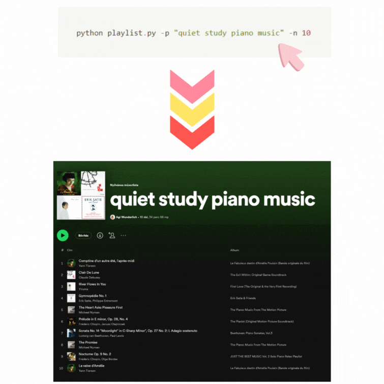

# Playlist Generator

This is a simple command-line utility that generates a playlist of songs based on a given prompt. It uses the OpenAI GPT-3.5 model and the Spotify API to create and add tracks to a playlist.

## Prerequisites

Before running the code, make sure you have the following:

- Python 3.x installed on your machine.
- An OpenAI API key. If you don't have one, sign up on the [OpenAI website](https://openai.com/) to get an API key.
- A Spotify developer account and access to client ID and client secret. You can create a Spotify developer account and register your application [here](https://developer.spotify.com/dashboard/).

## Installation

1. Clone or download the repository.
2. Install the required Python packages by running the following command:

   ```shell
   pip install -r requirements.txt
   ```

3. Create a .env file in the project directory and add the following environment variables:

   ```
   OPENAI_API_KEY=<your_openai_api_key>
   SPOTIFY_CLIENT_ID=<your_spotify_client_id>
   SPOTIFY_CLIENT_SECRET=<your_spotify_client_secret>
   ```

## Usage

The utility accepts command-line arguments to customize the playlist generation:

    python playlist_generator.py [-p PROMPT] [-n COUNT]

-p PROMPT: The prompt to describe the playlist. Default: "fun songs".
-n COUNT: The number of songs to add to the playlist. Default: 8.

Example usage:

    python playlist_generator.py -p "upbeat summer vibes" -n 10

The generated playlist will be printed to the console and added to your Spotify account as a private playlist.

## How it works

1. The utility uses the OpenAI GPT-3.5 model to generate a list of songs and their artists based on the provided prompt.
2. The generated playlist is returned as a JSON array, where each element follows the format: {"song": <song_title>, "artist": <artist_name>}.
3. The Spotify API is used to search for each song and retrieve its track ID.
4. A new private playlist is created on your Spotify account with the name specified in the prompt.
5. The retrieved track IDs are added to the created playlist.


